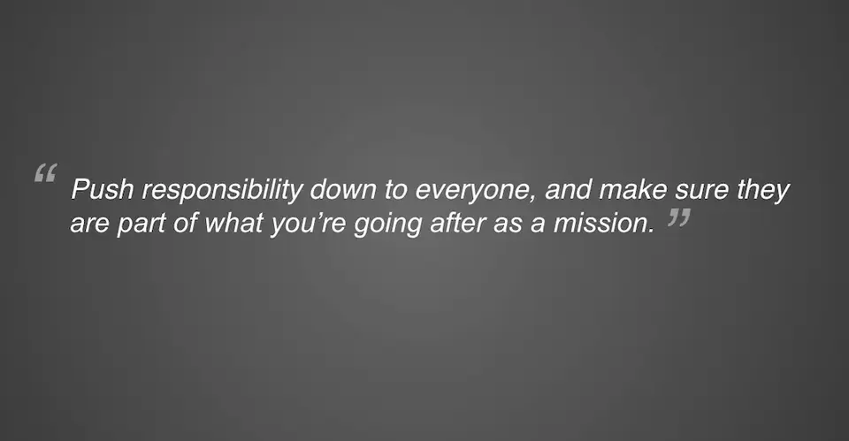

## 2018 Gartner Application Strategies and Solutions Summit

This Fall I got to go to the Gartner Application Summit held in Las Vegas.

This was my first Gartner conference and my first time in Las Vegas.

While the experience of being on the strip was overwhelming and over-stimulating, I did learn a lot of exciting new concepts and methodoligies at the conference.

## Top 3 Takeaways

### 1. 👑 Agile is King

> Netflix is famous for the ability to roll out thousands of changes a day

Everything depends on Agile. Waterfall is out and without Agile, everything else is impossible or very difficult. Agile is the key to open up the paths for these new ideas.

- Agile helps you deal with _chaos by embracing it_
- always delivering value
- allows for continous integration & devops

### 2. Productology

**Productology** is the art and science of delivering products in the digital age.

Some of the benefits of product-cetric design are

- outcome-based
- deliver capabilities over time
- ownership & accountability
- teams stay together
- empathy with customers & colleagues

### 🔥 3. Power of Culture

The final keynote was titled **"Architect Your Digital Ecosystem"**

It was on the culture of [MX](https://data.mx.com/). They empowered their team to just do the work. They had cool metrics on big screens. Team members loved working there and were filled with passion about the work. They felt they could make changes and get them in production on the same day. They rallied around their cause. The founder was in the trenches with the workers and they loved that he was doing the same work that they did.

One of the leaders was diagnosed with a late stage cancer and had only weeks or months to live, and the team worked on the weekend to found our more about the cause, courses of actions, list the best doctors, to help save their leader.

## Honorable Mentions

- API-Centric Design
- CI Pipeline
- PWAs

## Conclusion

After attending this conference, your heart is set on fire and you want to implement all these new trends.

While I am not in a leadership position, I feel that I can implement change at my level.

I am so glad that I was able to attend the conference. My heart is fire to disrupt our current rhythm and implement change.
