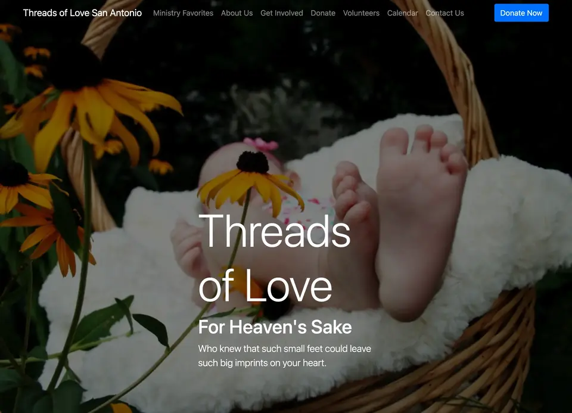
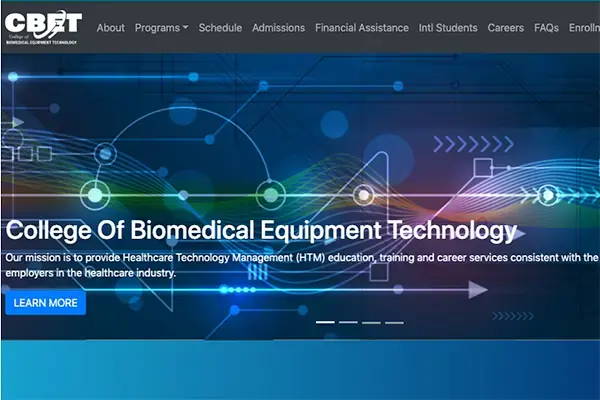

Here are some key projects I've worked on, ranging from Federal Government applications to client websites. Each project showcases different aspects
of my Front End Development and UX design skills.

##  OPRE Portfolio Management System 

Led Front End Development for a portfolio management system that streamlines OPRE's research and evaluation processes, reducing administrative
overhead for managers overseeing projects that impact children and families nationwide.

**My Role:** Front End Development, testing, CI/CD implementation, accessibility compliance 
**Tech:** React, Redux Toolkit, Vite, Vitest, USWDS

[View Github](https://github.com/HHS/OPRE-OPS)

 

## Benefits Eligibility Awareness Resource for USAGov

Americans often miss out on government benefits they qualify for due to complex eligibility requirements and scattered information across agencies.
BEARS empowers citizens to easily discover benefits they're entitled to, helping bridge the gap between available programs and those who need them
most.

**My Role:** Front End Development and UI design 
**Tech:** Vue, Nuxt, Vuex, search.gov, USWDS

[View Live](https://benefits-tool-beta.usa.gov/)  
[View Github](https://github.com/GSA/usagov-benefits-eligibility)

 

## USWDS Together Report

Government agencies needed visibility into the impact and adoption of the United States Web Design System across federal websites. This interactive report showcased community contributions and usage statistics to demonstrate the design system's value for the 3.3.0 release.

**My Role:** UX Design and Front End Development   
**Tech:** Jekyll, SASS, USWDS, Cloud.gov Pages

[View Live](https://designsystem.digital.gov/together/)  
[View Github](https://github.com/uswds/uswds-site/)

 

## Federal Risk and Authorization Management Program (FedRAMP) Automation

Cloud service providers faced lengthy manual processes to achieve FedRAMP compliance, creating barriers to Government cloud adoption. ASAP
streamlines these workflows, reducing time-to-authorization and helping agencies access modern cloud services faster.

**My Role:** UX Design and Front End Development 
**Tech:** TypeScript, React, SASS, USWDS, Cloud.gov Pages

[View Live](https://federalist-b6c4d61f-facd-4833-a4a9-554523a87147.sites.pages.cloud.gov/site/gsa/fedramp-automation/)  
[View Github](https://github.com/18F/fedramp-automation/)

 

## AMEDD Center of History & Heritage

Military personnel and researchers needed better access to Army medical history resources and archives. The outdated website hindered public access to critical historical information that preserves and shares the legacy of Army medical services.

**My Role:** Website redesign and development 
**Tech:** Gatsby, .NET API, search.gov, USWDS

[View Live][achh]

 

## Borden Institute

Military medical professionals needed better access to authoritative medical publications and resources. The redesigned site improved
discoverability and user experience, earning recognition with a [2020 Web Award for Best Retail Website](http://www.webaward.org/winner/35795/g6-business-technology-solutions--wins-2020-webaward-for-borden-institute.html).

**My Role:** Website redesign and development 
**Tech:** Gatsby, .NET API, USWDS

[View Live][borden]

 

## U.S. Army Medical Center of Excellence

Complex organizational structure and outdated design made it difficult for military medical personnel to access critical education resources and training materials. The redesigned site streamlined navigation and improved user experience, earning recognition with a [2019 Web Award for web development](http://www.webaward.org/winner/35327/pigeon-frank-s-jr--verastigui-hector-a-young-stephanie-a-bailey-james-e-cardwell-loretta-b-castillo-paul-engler-timothy-l-gilbert-nancy-j-fox-matthew-d-wins-2019-webaward-for-army-medical-department-center--school-hrcoe.html).

**My Role:** Website redesign and development 
**Tech:** Gatsby, .NET API, USWDS

[View Live][medcoe]

 

## Threads of Love For Heaven's Sake

A San Antonio non-profit chapter needed to transition from paper-based outreach to digital presence to better coordinate volunteers and accept online donations for their mission of providing comfort items to families in crisis.

**My Role:** Design and development from paper brochure to fully functional website with donation capabilities 
**Tech:** Gatsby, React, custom Google Sheets integration, Netlify

[View Live][tol]  
[View Github](https://github.com/sacodersunited/threads-of-love)

 

## College Of Biomedical Equipment Technology

An educational institution needed to modernize their outdated website with improved security and contemporary design to better serve students in the biomedical equipment field and enhance their online presence.

**My Role:** Website redesign with security hardening and modern tech stack implementation 
**Tech:** Gatsby, React, custom Google Sheets, Microsoft Azure, Netlify

[View Live][cbet]  
[View Github](https://github.com/sacodersunited/cbet)

 

## David Portillo Tenor

Professional opera singer needed a sophisticated digital portfolio to showcase performances, media, and biography to industry professionals and fans, with integrated calendar functionality for upcoming shows.

**My Role:** Web design and development with content management system 
**Tech:** Strapi backend, Gatsby frontend (2021 rebuild)

[View Github][david-portillo-gh]  
[View Live][david-portillo-live]

 

## Sean Dorr Portfolio

Graphic artist and designer required a clean, professional portfolio website to showcase creative work and attract potential clients in the design industry.

**My Role:** Web design and development 
**Tech:** Jekyll, GitHub Pages hosting

[View Github][sean-dorr-gh]  

 

[david-portillo-gh]: https://github.com/sacodersunited/portillo-tenor
[david-portillo-live]: http://davidportillotenor.com
[sean-dorr-gh]: https://github.com/seandorr/designer-portfolio
[medcoe]: https://medcoe.army.mil
[cbet]: https://cbet.edu
[borden]: https://medcoe.army.mil/borden
[achh]: https://achh.army.mil/
[tol]: https://threadsoflovesatx.org
